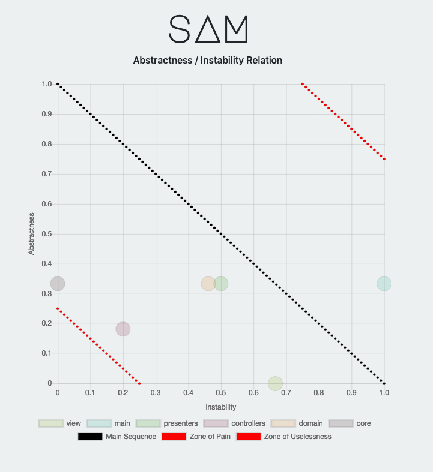
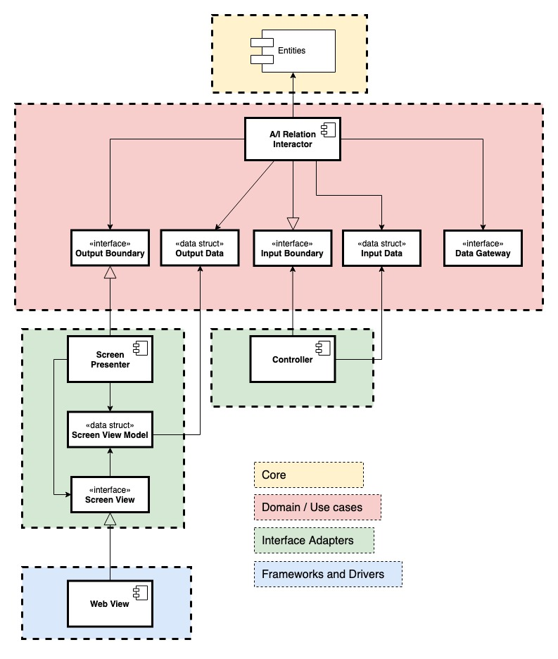

# S.A.M.
SAM (Software Architecture Metrics) is a naive tool that analyzes Scala source code retrieving module-level metrics 
helpful to the software architect.

## Getting Started
Download the distribution zip from the [releases](https://github.com/arabello/sam/releases) page and open it.
Open a new terminal window in the unzipped folder named `sam-x.x.x` and run `bin/sam --help` to show the usage instructions.
```
~$ bin/sam --help
sam 0.0.1
Usage: SAM [airelation] [options]

  -o, --out <path>         Specify the output path. Default is 'out'
Command: airelation [options]
Print out the Abstractness/Instability relation graph
  -fn, --fName <value>     Specify the output file name. Default is 'airelation.html'
  -h, --help               

```
 
## Metrics usage

### A/I Relation
The submitted modules are plotted into the Abstractness/Instability Graph showing the relation between each others.



The A/I Relation metric is defined as it is in the _Clean Architecture_ book by _Robert Martin_.

```
Abstractness = Na / Nc
Na = Number of classes in the module 
Nc = Number of abstract classes and interfaces in the module
```

```
Instability = fan-out / (fan-in + fan-out)
fan-in = Incoming dependencies
fan-out = Outgoing dependencies
```

>The Instability metric works for the dependencies related to the submitted modules avoiding 
>to consider the ones related to libraries or language specific in the calculation. 
>Due to this make sure to submit all the modules that the software you want to analyze is made of.

>SAM does not type check neither report compile errors. Please submit correct Scala code.

### Other metrics
All the available metrics are listed as commands of the CLI executable. 


SAM is a newborn and now provides only a single software architecture metric.
If you want to suggest a metric just open an issue.
You can also implement your own and [contribute](#contributing) to the project.

## Contributing
SAM is developed following the Clean Architecture guidelines.



The `core` module provides the entities and the Scala source code analyzer.
It simply parse the code retrieving the AST. It should not be modified.

The `domain` module contains the interactors (use cases). 
Each metric should be a use case that operate with the entities and the analyzer.
Basically a use case traverse the AST, retrieve information and calculate the metric.

Here an example from the `AIRelationInteractor`:

```scala
private class AIRelationTraverser(module: Component) extends Analyzer.Traverser{
    private var packages = Set[String]()
	private var imports = Set[Analyzer.Import]()
	private var numClasses = 0
	private var numAbstractClasses = 0

    override def traverse(tree: Analyzer.Tree): Unit = tree match {
        case Analyzer.ModuleDef(mods, name, impl) =>
            numClasses += 1
            super.traverse(impl)
            
        case Analyzer.ClassDef(mods, name, tparams, impl) =>
            if (mods.hasFlag(Analyzer.Flag.ABSTRACT))
                numAbstractClasses += 1
            numClasses += 1
            super.traverseTrees(tparams)
            super.traverse(impl)
            
        case node @ Analyzer.Import(expr, selectors) =>
            imports += node
            super.traverse(expr)
            
        case node @ Analyzer.PackageDef(pid, stats) =>
            packages += pid.toString()
            super.traverseTrees(stats)
            super.traverse(pid)
            
        case _ => super.traverse(tree)
    }

    def analizedModule: AnalizedModule = AnalizedModule(module, packages, imports, numClasses, numAbstractClasses)
}

val ast = Analyzer.parseCode(module)
val traverser = new AIRelationTraverser(module)
traverser.traverse(ast)
```


Adding a metric means adding an interactor, the boundaries interfaces and the input/output data structures
to the `domain` module in a new sub-package.

The `controllers` and `presenters` modules depend on `domain`. A new metric needs 
the related code in these modules. 

The `view` code implements what the presenter describe about the metric information.
It is the output the user see (text, an image, an HTML page, etc...)


## Contacts and notes
SAM is my first approach to Scala as a project for the 
Languages and Computational Models course at University of Bologna.

Matteo Pellegrino - matteo.pelle.pellegrino<@>gmail.com - [@mttpll](https://twitter.com/mttpll)

## MIT License

Copyright (c) 2019 Matteo Pellegrino
Permission is hereby granted, free of charge, to any person
obtaining a copy of this software and associated documentation
files (the "Software"), to deal in the Software without
restriction, including without limitation the rights to use,
copy, modify, merge, publish, distribute, sublicense, and/or sell
copies of the Software, and to permit persons to whom the
Software is furnished to do so, subject to the following
conditions:

The above copyright notice and this permission notice shall be
included in all copies or substantial portions of the Software.

THE SOFTWARE IS PROVIDED "AS IS", WITHOUT WARRANTY OF ANY KIND,
EXPRESS OR IMPLIED, INCLUDING BUT NOT LIMITED TO THE WARRANTIES
OF MERCHANTABILITY, FITNESS FOR A PARTICULAR PURPOSE AND
NONINFRINGEMENT. IN NO EVENT SHALL THE AUTHORS OR COPYRIGHT
HOLDERS BE LIABLE FOR ANY CLAIM, DAMAGES OR OTHER LIABILITY,
WHETHER IN AN ACTION OF CONTRACT, TORT OR OTHERWISE, ARISING
FROM, OUT OF OR IN CONNECTION WITH THE SOFTWARE OR THE USE OR
OTHER DEALINGS IN THE SOFTWARE.
